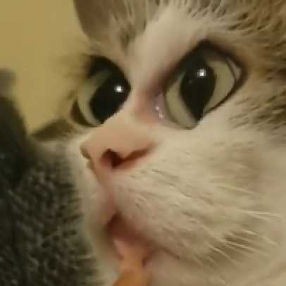

# Distortioner


Telegram bot for distorting pictures, stickers, voice messages and GIFs using Content Aware Scale.
Currently resides here: [@distortionerbot](https://t.me/distortionerbot)

## Usage
1. You'll need to install [ffmpeg](http://ffmpeg.org) and [ImageMagick](http://www.imagemagick.org/) with liquid-rescale enabled. For that you'll need to install [liblqr](https://github.com/carlobaldassi/liblqr) and glib-2.0, then [compile from source](https://imagemagick.org/script/install-source.php) (using AppImage might work too)
1. Create a bot with [@BotFather](https://t.me/BotFather), then set up a `DISTORTIONER_BOT_TOKEN` environment variable.
1. After that grab `distortioner` from releases or compile using `go build` command.

## Docker support
Fill out your bot token in distortioner.env, then launch as usual:
```Bash
sudo docker run -d --restart unless-stopped \
   --name distortioner \
   --env-file distortioner.env \
   -v /path/to/database/db.sqlite:/app/data/distortioner.sqlite
   ghcr.io/graynk/distortioner:latest
```

With Podman:
```Bash
podman run -d \
   --label "io.containers.autoupdate=image" \
   --name distortioner \
   --env-file distortioner.env \
   ghcr.io/graynk/distortioner:latest
cd ~/.config/systemd/user/
podman generate systemd --new --files --name distortioner
systemctl enable --user container-distortioner.service
loginctl enable-linger $USER
```

## TODO
* Distort animated stickers
* Make distortion increase throughout the video
* For stickers create and maintain a separate sticker pack for ease of use
* Don't trust Telegram with reported duration, get my own stats
* Localization, refactoring, tests
